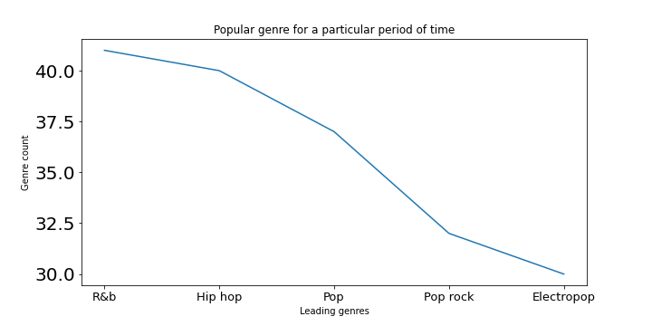

## Introduction
            This is a code repository of a data analysis and visualisation project done on Billboard's year
        end hot singles from the year 1947 to 2018. The project involves data extraction, preprocessing, 
        analysis and visualisation. 
 
## Data Extraction
            Billboard publishes annual lists of songs based on chart performance over the course of a year 
       based on Nielsen Broadcast Data Systems and SoundScan information. This list consists of ranking, 
       name of the song and the band name. 

            Webscrapping was done using beautiful soup to extract ranking, song, song url, band name and the
       band url. As we have data from 1947 to 2020, scrapping was done for all available years. The url 
       differs only in the year part, which was used to get those pages. 
       

## Data preprocessing
            For certain songs it was observed that there were more than one band. In those cases the band
       column was split and separate entries were made for the bands. From the song url information about the
       genre, release date and recorded date were available. From that the genre was extracted. While 
       extracting the genre information  it was found that there were multiple genres for several songs. So
       for analysis purposes all the genres were extracted. 
       

After preprocessing the dataframe we got was in the below format. The genre column is a list.

## Data Analysis and Visualisation
            Various analysis with the collected data were performed and they were visualised using matplotlib.

Based on the number of times a singer appears in the chart we rank them. Top 10 performers were 
       listed and plotted. Based on frequency the top 3 artists are Madonna, Rihanna and Drake. 
   

            But this might not be a very accurate measurement. What if an artist has a better overall 
       ranking than Madonna.  So to find that we calculate the cumulative ranking. That is their rank 
       subtracted from 101. By doing an aggregate sum we try to find the leaders again. Surprisingly Rihanna
       who has ranked second in the list based on frequency has topped the list based on cumulative ranking.
       Similarly Madonna who had topped the list based on the number of appearances has moved down to the 
       third position when ranked based on cumulative ranking.

It was found that the most popular genre of all time is R&b which has nearly 700 mentions. 
It is followed by pop and pop rock

In the previous case we found the most popular genre of all time. But what if we need to find the most 
popular genre in the timeframe 2012 - 2015. It was found that in recent years the popularity of hip hop
has risen.

Initially we found the popular singer of all time. What if we need to find the most popular singer for
the timeframe of 2012 to 2015. Nicki Minaj had topped this list. But his name was not on the top 10 lists
based on frequency and cumulative ranking. 

What if we need to compare the trends of different genres over a specified time period. Doing this might
provide insights on how the popularity of genres have increased or decreased comparatively. In this case
we see how R&b and pop rock progress over the years from 2008 to 2018.
